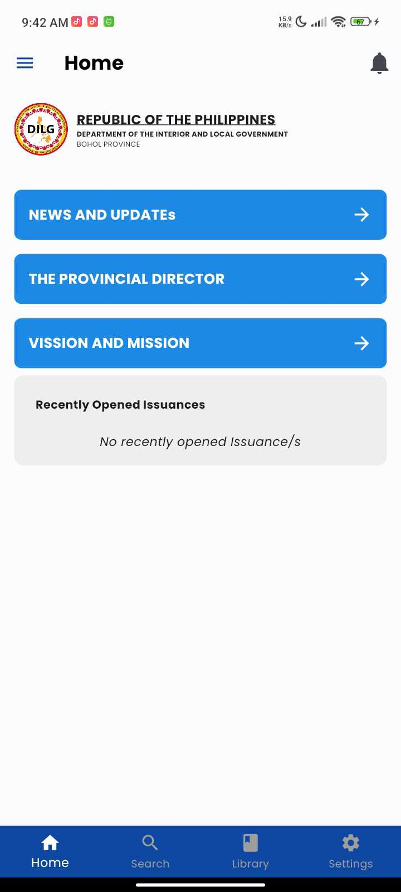
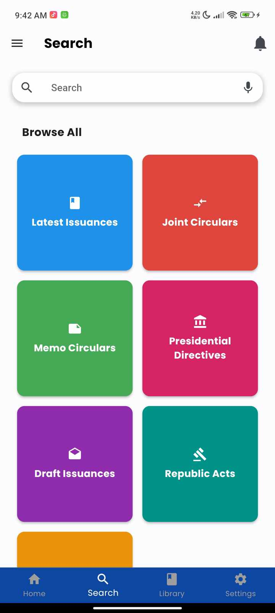
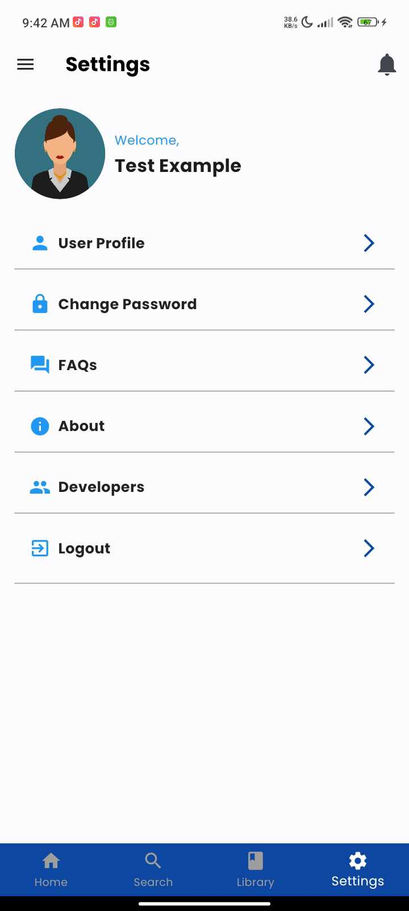

# DILG Issuances Mobile App

The DILG Bohol Issuances App is designed to house various issuances from the DILG Bohol Province, including the Latest Issuances, Joint Circulars, Memo Circulars, Presidential Directives, Draft Issuances, Republic Acts, and Legal Opinions. The primary objective of this app is to offer a comprehensive resource for accessing and staying updated on official documents and legal materials relevant to the province.

## Features

Here's a quick glimpse of the features within our DILG Issuances Mobile App:

| Feature                                              | Description                                                            |
|------------------------------------------------------|------------------------------------------------------------------------|
|                   | **Home Page:** Provides an overview of the app's content and navigation options. |
|               | **Search Page:** Allows users to search for specific issuances or documents.   |
|        | **Developers Page:** Profiles of the development team behind the app.          |
|           | **Settings Page:** Access app settings and customization options.             |

## Developers

- **Team Leader:**
  - Eunizel Gabas
  
- **Members:**
  - Eula Gabas
  - Angela Cecelia Lenteria
  - Bruce Unabia
  - John Lyod Catalan
